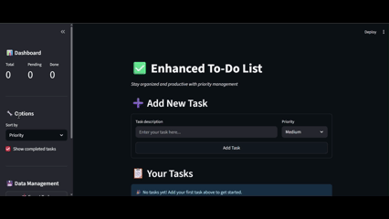

# Enhanced To-Do List App

A modern, feature-rich To-Do List built with [Streamlit](https://streamlit.io/) for easy task management, prioritization, and productivity tracking.

## Features

- **Add, Edit, Delete Tasks:** Manage your daily tasks with ease.
- **Priority Levels:** Assign High, Medium, or Low priority to each task.
- **Completion Tracking:** Mark tasks as done and view completion rates.
- **Statistics Dashboard:** Visual summary of total, pending, and completed tasks.
- **Sorting & Filtering:** Sort tasks by priority, date, or alphabetically; filter completed tasks.
- **Data Export/Import:** Backup or restore your tasks in JSON format.
- **Responsive UI:** Clean, user-friendly interface with custom styling.

## Screenshots



## Getting Started

### Prerequisites

- Python 3.8+
- [Streamlit](https://streamlit.io/)

### Installation

1. Clone the repository:
	```bash
	git clone https://github.com/Prath-Digital/Python_Streamlit_Pr.-1-Todo-List.git
	cd Python_Streamlit_Pr.-1-Todo-List
	```
2. Install dependencies:
	```bash
	pip install streamlit
	```

### Running the App

```bash
streamlit run app.py
```

## File Structure

- `app.py` — Main Streamlit application
- `tasks.json` — Local storage for tasks
- `assets/logo.png` — App logo

## Contributing

Contributions are welcome! Please open issues or submit pull requests for improvements.

## License

This project is licensed under the MIT License.